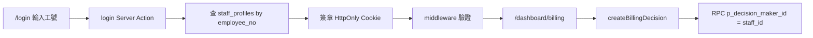

# 工號登入、認領看板保護與認領人顯示

## 現況摘要

- [`actions/billing/decisions.ts`](actions/billing/decisions.ts) 的 `createBillingDecision` 已支援 `decision_maker_id`，但 [`components/billing/decision-board.tsx`](components/billing/decision-board.tsx) 未傳入，故 DB 中皆為 `NULL`。
- Schema 已有 [`billing_decisions.decision_maker_id` → `staff_profiles(id)`](supabase/migrations/001_initial_schema.sql)；RPC [`create_billing_decision_transaction`](supabase/migrations/004_claim_center_claiming.sql) 已接受 `p_decision_maker_id`。
- [`decided_billing_decisions_summary`](supabase/migrations/20260412130000_billing_views_facility_mapping_count.sql) 目前僅 join 工時上的 `staff_profiles`（現場人員），**未** join 裁決者，故無法顯示「誰認領」。
- [`middleware.ts`](middleware.ts) 僅設 `Cache-Control`，無身分檢查。

## 架構選擇（簡述）

| 項目 | 決定 |
|------|------|
| 登入方式 | 僅輸入 `employee_no`，後端查 `staff_profiles`（需有唯一索引 [`idx_staff_profiles_employee_no`](supabase/migrations/20260414021103_extend_staff_profiles_columns.sql)） |
| 工作階段 | **自訂簽章 JWT（建議 `jose`）** 存 HttpOnly Cookie，payload 含 `staff_id`、`name`、`employee_no`、過期時間；**不依賴** Supabase Auth（後續若要密碼可再銜接 `auth.users`） |
| `decision_maker_id` | **僅在 Server Action 從工作階段寫入**，忽略（或移除）客戶端傳入的 `decision_maker_id`，避免偽造認領人 |

## 1. 資料庫（Migration First）

- 新增 migration：`CREATE OR REPLACE VIEW decided_billing_decisions_summary AS ...`，在現有 [`20260412130000_billing_views_facility_mapping_count.sql`](supabase/migrations/20260412130000_billing_views_facility_mapping_count.sql) 的 `decided` 定義基礎上：
  - `LEFT JOIN staff_profiles dm ON bd.decision_maker_id = dm.id`
  - 選出 `decision_maker_id`、`decision_maker_name`（`dm.name`）
- `pending_billing_decisions_summary` 可維持不變（待認領列無認領人）。
- 合併前執行 `npm run schema:consolidated`、型別 `npx supabase gen types typescript --local > types/supabase.ts`（與 [supabase-migration-workflow](.cursor/rules/supabase-migration-workflow.mdc) 一致）。

## 2. 應用層：工作階段與登入頁

- **依賴**：新增 `jose`（Edge / Middleware 相容，用於 HS256 簽章）。
- **環境變數**：例如 `YCS_SESSION_SECRET`（32+ bytes 隨機字串），僅伺服端使用。
- **模組**（建議路徑）：
  - `lib/auth/session.ts`：`signSession` / `verifySession` / `getSessionFromCookies()`（供 Server Component、Server Action 使用）
  - `actions/auth/login.ts` / `logout.ts`：查工號、設定／清除 Cookie
- **頁面**：[`app/login/page.tsx`](app/login/page.tsx)（或 `app/(auth)/login/page.tsx`）— 表單 + 錯誤訊息（工號不存在、空白等）；成功後 `redirect` 至 `searchParams` 的 `next` 或預設 `/dashboard/billing`。

## 3. Middleware 與路由保護

- 擴充 [`middleware.ts`](middleware.ts)：
  - **matcher** 加入需保護的路徑：`/dashboard/billing`、`/dashboard/billing/:path*`、`/api/billing/:path*`
  - 無有效 Cookie → `redirect` 至 `/login?next=<encoded path>`
  - 保留既有 `Cache-Control: no-store`
- **注意**：Middleware 僅能讀 Cookie + 驗簽；**業務寫入仍以 Server Action 內再驗一次**（防繞過直接呼叫 Action）。

## 4. 認領流程與 UI

- **[`createBillingDecision`](actions/billing/decisions.ts)**：開頭 `getSession()`；無 session → `{ success: false, error: '請先登入' }`；有 session → `p_decision_maker_id: session.staffId`（**不再**接受外部傳入的 maker id）。
- **[`PendingBillingDecision`](actions/billing/queries.ts)**：新增 `decision_maker_id?: string | null`、`decision_maker_name?: string | null`。
- **[`decision-table.tsx`](components/billing/decision-table.tsx)**：當 `viewMode === 'after' || 'summary'` 時新增欄位「認領人員」（顯示 `decision_maker_name ?? '-'`）；可選加入排序 key `decision_maker_name`。
- **[`dashboard-nav.tsx`](components/dashboard/dashboard-nav.tsx)**：由 [`app/dashboard/layout.tsx`](app/dashboard/layout.tsx)（改為 `async`）讀取 session，傳入目前登入者姓名／工號與「登出」Server Action 或連結（登出可為簡單的 `form action`）。
- **[`app/dashboard/billing/page.tsx`](app/dashboard/billing/page.tsx)**：可選在標題旁顯示「目前認領身分：xxx」與 layout 資訊不重複則省略。

## 5. 安全與行為說明（給團隊）

- 無密碼時，**知悉工號即可登入**；僅適合內網／過渡期；上線密碼應改為 Supabase Auth 或企業 SSO，並保留 `decision_maker_id` 寫入邏輯。
- 舊資料 `decision_maker_id` 為 `NULL` 時，UI 顯示 `-`。

## 主要修改檔案

| 區塊 | 檔案 |
|------|------|
| DB | 新 migration under `supabase/migrations/`、`supabase/consolidated_schema.sql`（腳本產出）、`types/supabase.ts` |
| Auth | `lib/auth/session.ts`、`actions/auth/*.ts`、`app/login/page.tsx`、`middleware.ts` |
| 認領 | `actions/billing/decisions.ts`、`actions/billing/queries.ts`、`components/billing/decision-table.tsx`、`app/dashboard/layout.tsx`、`components/dashboard/dashboard-nav.tsx` |
| 依賴 | `package.json`（`jose`） |
